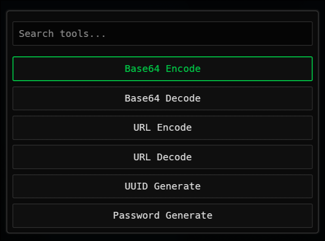

# Panoply

Tiny and fast desktop utility for common developer tasks. Built with [egui](https://github.com/emilk/egui) in Rust.



## Features

- **Base64 Encode / Decode**
- **URL Encode / Decode**
- **UUID Generate**
- **Password Generate**

Quick search and keyboard navigation (arrow keys + enter) to jump between tools.

Still **WIP**

## Usage on NixOS (with Flakes)

### Run with Nix

```bash
nix run github:Code-Growers/panoply
```
